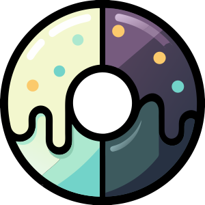

<p align="center">
  
</p>

<h1 align="center">Glaze</h1>

<p align="center">
  OKHSL-based color theme generator with WCAG contrast solving
</p>

<p align="center">
  <a href="https://www.npmjs.com/package/@tenphi/glaze"></a>
  <a href="https://github.com/tenphi/glaze/actions/workflows/ci.yml"></a>
  <a href="https://github.com/tenphi/glaze/blob/main/LICENSE"></a>
</p>

---

Glaze generates robust **light**, **dark**, and **high-contrast** color schemes from a single hue/saturation seed. It preserves WCAG contrast ratios for UI color pairs via explicit dependency declarations — no hidden role math, no magic multipliers.

## Features

- **OKHSL color space** — perceptually uniform hue and saturation
- **WCAG 2 contrast solving** — automatic lightness adjustment to meet AA/AAA targets
- **Light + Dark + High-Contrast** — all schemes from one definition
- **Multi-format output** — `okhsl`, `rgb`, `hsl`, `oklch`
- **Import/Export** — serialize and restore theme configurations
- **Create from hex/RGB** — start from an existing brand color
- **Zero dependencies** — pure math, runs anywhere (Node.js, browser, edge)
- **Tree-shakeable ESM + CJS** — dual-format package
- **TypeScript-first** — full type definitions included

## Installation

```bash
pnpm add @tenphi/glaze
```

```bash
npm install @tenphi/glaze
```

```bash
yarn add @tenphi/glaze
```

## Quick Start

```ts
import { glaze } from '@tenphi/glaze';

// Create a theme from a hue (0–360) and saturation (0–100)
const primary = glaze(280, 80);

// Define colors with explicit lightness and contrast relationships
primary.colors({
  surface:    { l: 97, sat: 0.75 },
  text:       { base: 'surface', contrast: 52, ensureContrast: 'AAA' },
  border:     { base: 'surface', contrast: [7, 20], ensureContrast: 'AA-large' },
  'accent-fill': { l: 52, mode: 'fixed' },
  'accent-text': { base: 'accent-fill', contrast: 48, ensureContrast: 'AA', mode: 'fixed' },
});

// Create status themes by rotating the hue
const danger  = primary.extend({ hue: 23 });
const success = primary.extend({ hue: 157 });

// Compose into a palette and export
const palette = glaze.palette({ primary, danger, success });
const tokens = palette.tokens({ prefix: true });
// → { '#primary-surface': { '': 'okhsl(...)', '@dark': 'okhsl(...)' }, ... }
```

## Core Concepts

### One Theme = One Hue Family

A single `glaze` theme is tied to one hue/saturation seed. Status colors (danger, success, warning) are derived via `extend`, which inherits all color definitions and replaces the seed.

### Color Definitions

Every color is defined explicitly. No implicit roles — every value is stated.

#### Root Colors (explicit position)

```ts
primary.colors({
  surface: { l: 97, sat: 0.75 },
  border:  { l: 90, sat: 0.20 },
});
```

- `l` — lightness in the light scheme (0–100)
- `sat` — saturation factor applied to the seed saturation (0–1, default: `1`)

#### Dependent Colors (relative to base)

```ts
primary.colors({
  surface: { l: 97, sat: 0.75 },
  text:    { base: 'surface', contrast: 52, ensureContrast: 'AAA' },
});
```

- `base` — name of another color in the same theme
- `contrast` — lightness delta from the base color
- `ensureContrast` — ensures the WCAG contrast ratio meets a target floor against the base

Both `contrast` and `ensureContrast` are considered. The effective lightness satisfies both constraints — the more demanding one wins.

### Contrast Sign Convention

| Sign | Behavior |
|---|---|
| Negative (`-52`) | Always darker than base |
| Positive (`+48`) | Always lighter than base |
| Unsigned (`52`) | Auto-resolved: if `base_L + contrast > 100`, flips to negative |

```ts
// Surface L=97
'text': { base: 'surface', contrast: 52 }
// → 97 + 52 = 149 > 100 → flips to 97 - 52 = 45 ✓

// Button fill L=52
'accent-text': { base: 'accent-fill', contrast: 48 }
// → 52 + 48 = 100 → keeps as 100 ✓
```

### ensureContrast (WCAG Floor)

Ensures the WCAG contrast ratio meets a target floor. Accepts a numeric ratio or a preset string:

```ts
type MinContrast = number | 'AA' | 'AAA' | 'AA-large' | 'AAA-large';
```

| Preset | Ratio |
|---|---|
| `'AA'` | 4.5 |
| `'AAA'` | 7 |
| `'AA-large'` | 3 |
| `'AAA-large'` | 4.5 |

You can also pass any numeric ratio directly (e.g., `ensureContrast: 4.5`, `ensureContrast: 7`, `ensureContrast: 11`).

The constraint is applied independently for each scheme. If the `contrast` delta already satisfies the floor, it's kept. Otherwise, the solver adjusts lightness until the target is met.

### High-Contrast via Array Values

`contrast`, `ensureContrast`, and `l` accept a `[normal, high-contrast]` pair:

```ts
'border': { base: 'surface', contrast: [7, 20], ensureContrast: 'AA-large' }
//                                      ↑   ↑
//                                  normal  high-contrast
```

A single value applies to both modes. All control is local and explicit.

```ts
'text':   { base: 'surface', contrast: 52, ensureContrast: 'AAA' }
'border': { base: 'surface', contrast: [7, 20], ensureContrast: 'AA-large' }
'muted':  { base: 'surface', contrast: [35, 50], ensureContrast: ['AA-large', 'AA'] }
```

## Theme Color Management

### Adding Colors

`.colors(defs)` performs an **additive merge** — it adds new colors and overwrites existing ones by name, but does not remove other colors:

```ts
const theme = glaze(280, 80);
theme.colors({ surface: { l: 97 } });
theme.colors({ text: { l: 30 } });
// Both 'surface' and 'text' are now defined
```

### Single Color Getter/Setter

`.color(name)` returns the definition, `.color(name, def)` sets it:

```ts
theme.color('surface', { l: 97, sat: 0.75 }); // set
const def = theme.color('surface');             // get → { l: 97, sat: 0.75 }
```

### Removing Colors

`.remove(name)` or `.remove([name1, name2])` deletes color definitions:

```ts
theme.remove('surface');
theme.remove(['text', 'border']);
```

### Introspection

```ts
theme.has('surface');  // → true/false
theme.list();          // → ['surface', 'text', 'border', ...]
```

### Clearing All Colors

```ts
theme.reset(); // removes all color definitions
```

## Import / Export

Serialize a theme's configuration (hue, saturation, color definitions) to a plain JSON-safe object, and restore it later:

```ts
// Export
const snapshot = theme.export();
// → { hue: 280, saturation: 80, colors: { surface: { l: 97, sat: 0.75 }, ... } }

const jsonString = JSON.stringify(snapshot);

// Import
const restored = glaze.from(JSON.parse(jsonString));
// restored is a fully functional GlazeTheme
```

The export contains only the configuration — not resolved color values. Resolved values are recomputed on demand.

## Standalone Color Token

Create a single color token without a full theme:

```ts
const accent = glaze.color({ hue: 280, saturation: 80, l: 52, mode: 'fixed' });

accent.resolve();  // → ResolvedColor with light/dark/lightContrast/darkContrast
accent.token();    // → { '': 'okhsl(...)', '@dark': 'okhsl(...)' }
accent.json();     // → { light: 'okhsl(...)', dark: 'okhsl(...)' }
```

Standalone colors are always root colors (no `base`/`contrast`/`ensureContrast`).

## From Existing Colors

Create a theme from an existing brand color by extracting its OKHSL hue and saturation:

```ts
// From hex
const brand = glaze.fromHex('#7a4dbf');

// From RGB (0–255)
const brand = glaze.fromRgb(122, 77, 191);
```

The resulting theme has the extracted hue and saturation. Add colors as usual:

```ts
brand.colors({
  surface: { l: 97, sat: 0.75 },
  text:    { base: 'surface', contrast: 52, ensureContrast: 'AAA' },
});
```

## Output Formats

Control the color format in exports with the `format` option:

```ts
// Default: OKHSL
theme.tokens();                        // → 'okhsl(280.0 60.0% 97.0%)'

// RGB with fractional precision
theme.tokens({ format: 'rgb' });       // → 'rgb(244.123, 240.456, 249.789)'

// HSL
theme.tokens({ format: 'hsl' });       // → 'hsl(270.5, 45.2%, 95.8%)'

// OKLCH
theme.tokens({ format: 'oklch' });     // → 'oklch(96.5% 0.0123 280.0)'
```

The `format` option works on all export methods: `theme.tokens()`, `theme.json()`, `palette.tokens()`, `palette.json()`, and standalone `glaze.color().token()` / `.json()`.

Available formats:

| Format | Output | Notes |
|---|---|---|
| `'okhsl'` (default) | `okhsl(H S% L%)` | Native format, perceptually uniform |
| `'rgb'` | `rgb(R, G, B)` | Fractional 0–255 values (3 decimals) |
| `'hsl'` | `hsl(H, S%, L%)` | Standard CSS HSL |
| `'oklch'` | `oklch(L% C H)` | OKLab-based LCH |

## Adaptation Modes

Modes control how colors adapt across schemes:

| Mode | Behavior |
|---|---|
| `'auto'` (default) | Full adaptation. Light ↔ dark inversion. High-contrast boost. |
| `'fixed'` | Color stays recognizable. Only safety corrections. For brand buttons, CTAs. |
| `'static'` | No adaptation. Same value in every scheme. |

### How `contrast` Adapts

**`auto` mode** — contrast sign flips in dark scheme:

```ts
// Light: surface L=97, text contrast=52 → L=45 (dark text on light bg)
// Dark:  surface inverts to L≈14, sign flips → L=14+52=66
//        ensureContrast solver may push further (light text on dark bg)
```

**`fixed` mode** — lightness is mapped (not inverted), contrast sign preserved:

```ts
// Light: accent-fill L=52, accent-text contrast=+48 → L=100 (white on brand)
// Dark:  accent-fill maps to L≈51.6, sign preserved → L≈99.6
```

**`static` mode** — no adaptation, same value in every scheme.

## Dark Scheme Mapping

### Lightness

**`auto`** — inverted within the configured window:

```ts
const [lo, hi] = darkLightness; // default: [10, 90]
const invertedL = ((100 - lightness) * (hi - lo)) / 100 + lo;
```

**`fixed`** — mapped without inversion:

```ts
const mappedL = (lightness * (hi - lo)) / 100 + lo;
```

| Color | Light L | Auto (inverted) | Fixed (mapped) |
|---|---|---|---|
| surface (L=97) | 97 | 12.4 | 87.6 |
| accent-fill (L=52) | 52 | 48.4 | 51.6 |
| accent-text (L=100) | 100 | 10 | 90 |

### Saturation

`darkDesaturation` reduces saturation for all colors in dark scheme:

```ts
S_dark = S_light * (1 - darkDesaturation) // default: 0.1
```

## Inherited Themes (`extend`)

`extend` creates a new theme inheriting all color definitions, replacing the hue and/or saturation seed:

```ts
const primary = glaze(280, 80);
primary.colors({ /* ... */ });

const danger  = primary.extend({ hue: 23 });
const success = primary.extend({ hue: 157 });
const warning = primary.extend({ hue: 84 });
```

Override individual colors (additive merge):

```ts
const danger = primary.extend({
  hue: 23,
  colors: { 'accent-fill': { l: 48, mode: 'fixed' } },
});
```

## Palette Composition

Combine multiple themes into a single palette:

```ts
const palette = glaze.palette({ primary, danger, success, warning });
```

### Token Export

```ts
const tokens = palette.tokens({ prefix: true });
// → {
//   '#primary-surface': { '': 'okhsl(...)', '@dark': 'okhsl(...)' },
//   '#danger-surface':  { '': 'okhsl(...)', '@dark': 'okhsl(...)' },
// }
```

Custom prefix mapping:

```ts
palette.tokens({ prefix: { primary: 'brand-', danger: 'error-' } });
```

### JSON Export (Framework-Agnostic)

```ts
const data = palette.json({ prefix: true });
// → {
//   primary: { surface: { light: 'okhsl(...)', dark: 'okhsl(...)' } },
//   danger:  { surface: { light: 'okhsl(...)', dark: 'okhsl(...)' } },
// }
```

## Output Modes

Control which scheme variants appear in exports:

```ts
// Light only
palette.tokens({ modes: { dark: false, highContrast: false } });

// Light + dark (default)
palette.tokens({ modes: { highContrast: false } });

// All four variants
palette.tokens({ modes: { dark: true, highContrast: true } });
```

Resolution priority (highest first):

1. `tokens({ modes })` / `json({ modes })` — per-call override
2. `glaze.configure({ modes })` — global config
3. Built-in default: `{ dark: true, highContrast: false }`

## Configuration

```ts
glaze.configure({
  darkLightness: [10, 90],    // Dark scheme lightness window [lo, hi]
  darkDesaturation: 0.1,       // Saturation reduction in dark scheme (0–1)
  states: {
    dark: '@dark',             // State alias for dark mode tokens
    highContrast: '@high-contrast',
  },
  modes: {
    dark: true,                // Include dark variants in exports
    highContrast: false,       // Include high-contrast variants
  },
});
```

## Color Definition Shape

```ts
type HCPair<T> = T | [T, T]; // [normal, high-contrast]

interface ColorDef {
  // Root color (explicit position)
  l?: HCPair<number>;    // 0–100, light scheme lightness
  sat?: number;           // 0–1, saturation factor (default: 1)

  // Dependent color (relative to base)
  base?: string;                  // name of another color
  contrast?: HCPair<number>;     // lightness delta from base
  ensureContrast?: HCPair<MinContrast>; // ensures WCAG contrast ratio meets target floor

  // Adaptation mode
  mode?: 'auto' | 'fixed' | 'static'; // default: 'auto'
}
```

Every color must have either `l` (root) or `base` + `contrast` (dependent).

## Validation

| Condition | Behavior |
|---|---|
| Both `l` and `base` on same color | Warning, `l` takes precedence |
| `contrast` without `base` | Validation error |
| `l` resolves outside 0–100 | Clamp silently |
| `sat` outside 0–1 | Clamp silently |
| Circular `base` references | Validation error |
| `base` references non-existent name | Validation error |

## Advanced: Color Math Utilities

Glaze re-exports its internal color math for advanced use:

```ts
import {
  okhslToLinearSrgb,
  okhslToSrgb,
  okhslToOklab,
  srgbToOkhsl,
  parseHex,
  relativeLuminanceFromLinearRgb,
  contrastRatioFromLuminance,
  formatOkhsl,
  formatRgb,
  formatHsl,
  formatOklch,
  findLightnessForContrast,
  resolveMinContrast,
} from '@tenphi/glaze';
```

## Full Example

```ts
import { glaze } from '@tenphi/glaze';

const primary = glaze(280, 80);

primary.colors({
  surface:    { l: 97, sat: 0.75 },
  text:       { base: 'surface', contrast: 52, ensureContrast: 'AAA' },
  border:     { base: 'surface', contrast: [7, 20], ensureContrast: 'AA-large' },
  bg:         { l: 97, sat: 0.75 },
  icon:       { l: 60, sat: 0.94 },
  'accent-fill': { l: 52, mode: 'fixed' },
  'accent-text': { base: 'accent-fill', contrast: 48, ensureContrast: 'AA', mode: 'fixed' },
  disabled:   { l: 81, sat: 0.40 },
});

const danger  = primary.extend({ hue: 23 });
const success = primary.extend({ hue: 157 });
const warning = primary.extend({ hue: 84 });
const note    = primary.extend({ hue: 302 });

const palette = glaze.palette({ primary, danger, success, warning, note });

// Export as OKHSL tokens (default)
const tokens = palette.tokens({ prefix: true });

// Export as RGB for broader CSS compatibility
const rgbTokens = palette.tokens({ prefix: true, format: 'rgb' });

// Save and restore a theme
const snapshot = primary.export();
const restored = glaze.from(snapshot);

// Create from an existing brand color
const brand = glaze.fromHex('#7a4dbf');
brand.colors({ surface: { l: 97 }, text: { base: 'surface', contrast: 52 } });
```

## API Reference

### Theme Creation

| Method | Description |
|---|---|
| `glaze(hue, saturation?)` | Create a theme from hue (0–360) and saturation (0–100) |
| `glaze({ hue, saturation })` | Create a theme from an options object |
| `glaze.from(data)` | Create a theme from an exported configuration |
| `glaze.fromHex(hex)` | Create a theme from a hex color (`#rgb` or `#rrggbb`) |
| `glaze.fromRgb(r, g, b)` | Create a theme from RGB values (0–255) |
| `glaze.color(input)` | Create a standalone color token |

### Theme Methods

| Method | Description |
|---|---|
| `theme.colors(defs)` | Add/replace colors (additive merge) |
| `theme.color(name)` | Get a color definition |
| `theme.color(name, def)` | Set a single color definition |
| `theme.remove(names)` | Remove one or more colors |
| `theme.has(name)` | Check if a color is defined |
| `theme.list()` | List all defined color names |
| `theme.reset()` | Clear all color definitions |
| `theme.export()` | Export configuration as JSON-safe object |
| `theme.extend(options)` | Create a child theme |
| `theme.resolve()` | Resolve all colors |
| `theme.tokens(options?)` | Export as token map |
| `theme.json(options?)` | Export as plain JSON |

### Global Configuration

| Method | Description |
|---|---|
| `glaze.configure(config)` | Set global configuration |
| `glaze.palette(themes)` | Compose themes into a palette |
| `glaze.getConfig()` | Get current global config |
| `glaze.resetConfig()` | Reset to defaults |

## License

[MIT](LICENSE)
