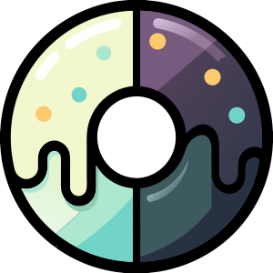

<p align="center">
  
</p>

<h1 align="center">Glaze</h1>

<p align="center">
  OKHSL-based color theme generator with WCAG contrast solving
</p>

<p align="center">
  <a href="https://www.npmjs.com/package/@tenphi/glaze"></a>
  <a href="https://github.com/tenphi/glaze/actions/workflows/ci.yml"></a>
  <a href="https://github.com/tenphi/glaze/blob/main/LICENSE"></a>
</p>

---

Glaze generates robust **light**, **dark**, and **high-contrast** color schemes from a single hue/saturation seed. It preserves WCAG contrast ratios for UI color pairs via explicit dependency declarations — no hidden role math, no magic multipliers.

## Features

- **OKHSL color space** — perceptually uniform hue and saturation
- **WCAG 2 contrast solving** — automatic lightness adjustment to meet AA/AAA targets
- **Mix colors** — blend two colors with OKHSL or sRGB interpolation, opaque or transparent, with optional contrast solving
- **Shadow colors** — OKHSL-native shadow computation with automatic alpha, fg/bg tinting, and per-scheme adaptation
- **Light + Dark + High-Contrast** — all schemes from one definition
- **Per-color hue override** — absolute or relative hue shifts within a theme
- **Multi-format output** — `okhsl`, `rgb`, `hsl`, `oklch` with modern CSS space syntax
- **CSS custom properties export** — ready-to-use `--var: value;` declarations per scheme
- **Import/Export** — serialize and restore theme configurations
- **Create from hex/RGB** — start from an existing brand color
- **Zero dependencies** — pure math, runs anywhere (Node.js, browser, edge)
- **Tree-shakeable ESM + CJS** — dual-format package
- **TypeScript-first** — full type definitions included

## Installation

```bash
pnpm add @tenphi/glaze
```

```bash
npm install @tenphi/glaze
```

```bash
yarn add @tenphi/glaze
```

## Quick Start

```ts
import { glaze } from '@tenphi/glaze';

// Create a theme from a hue (0–360) and saturation (0–100)
const primary = glaze(280, 80);

// Define colors with explicit lightness and contrast relationships
primary.colors({
  surface:       { lightness: 97, saturation: 0.75 },
  text:          { base: 'surface', lightness: '-52', contrast: 'AAA' },
  border:        { base: 'surface', lightness: ['-7', '-20'], contrast: 'AA-large' },
  'accent-fill': { lightness: 52, mode: 'fixed' },
  'accent-text': { base: 'accent-fill', lightness: '+48', contrast: 'AA', mode: 'fixed' },
});

// Create status themes by rotating the hue
const danger  = primary.extend({ hue: 23 });
const success = primary.extend({ hue: 157 });

// Compose into a palette and export
const palette = glaze.palette({ primary, danger, success });
const tokens = palette.tokens({ prefix: true });
// → { light: { 'primary-surface': 'okhsl(...)', ... }, dark: { 'primary-surface': 'okhsl(...)', ... } }
```

## Core Concepts

### One Theme = One Hue Family

A single `glaze` theme is tied to one hue/saturation seed. Status colors (danger, success, warning) are derived via `extend`, which inherits all color definitions and replaces the seed.

Individual colors can override the hue via the `hue` prop (see [Per-Color Hue Override](#per-color-hue-override)), but the primary purpose of a theme is to scope colors with the same hue.

### Color Definitions

Every color is defined explicitly. No implicit roles — every value is stated.

#### Root Colors (explicit position)

```ts
primary.colors({
  surface: { lightness: 97, saturation: 0.75 },
  border:  { lightness: 90, saturation: 0.20 },
});
```

- `lightness` — lightness in the light scheme (0–100)
- `saturation` — saturation factor applied to the seed saturation (0–1, default: `1`)

#### Dependent Colors (relative to base)

```ts
primary.colors({
  surface: { lightness: 97, saturation: 0.75 },
  text:    { base: 'surface', lightness: '-52', contrast: 'AAA' },
});
```

- `base` — name of another color in the same theme
- `lightness` — position of this color (see [Lightness Values](#lightness-values))
- `contrast` — ensures the WCAG contrast ratio meets a target floor against the base

### Lightness Values

The `lightness` prop accepts two forms:

| Form | Example | Meaning |
|---|---|---|
| Number (absolute) | `lightness: 45` | Absolute lightness 0–100 |
| String (relative) | `lightness: '-52'` | Relative to base color's lightness |

**Absolute lightness** on a dependent color (with `base`) positions the color independently. In dark mode, it is dark-mapped on its own. The `contrast` WCAG solver acts as a safety net.

**Relative lightness** applies a signed delta to the base color's resolved lightness. In dark mode with `auto` adaptation, the sign flips automatically.

```ts
// Relative: 97 - 52 = 45 in light mode
'text': { base: 'surface', lightness: '-52' }

// Absolute: lightness 45 in light mode, dark-mapped independently
'text': { base: 'surface', lightness: 45 }
```

A dependent color with `base` but no `lightness` inherits the base's lightness (equivalent to a delta of 0).

### Per-Color Hue Override

Individual colors can override the theme's hue. The `hue` prop accepts:

| Form | Example | Meaning |
|---|---|---|
| Number (absolute) | `hue: 120` | Absolute hue 0–360 |
| String (relative) | `hue: '+20'` | Relative to the **theme seed** hue |

**Important:** Relative hue is always relative to the **theme seed hue**, not to a base color's hue.

```ts
const theme = glaze(280, 80);
theme.colors({
  surface:     { lightness: 97 },
  // Gradient end — slight hue shift from seed (280 + 20 = 300)
  gradientEnd: { lightness: 90, hue: '+20' },
  // Entirely different hue
  warning:     { lightness: 60, hue: 40 },
});
```

### contrast (WCAG Floor)

Ensures the WCAG contrast ratio meets a target floor. Accepts a numeric ratio or a preset string:

```ts
type MinContrast = number | 'AA' | 'AAA' | 'AA-large' | 'AAA-large';
```

| Preset | Ratio |
|---|---|
| `'AA'` | 4.5 |
| `'AAA'` | 7 |
| `'AA-large'` | 3 |
| `'AAA-large'` | 4.5 |

You can also pass any numeric ratio directly (e.g., `contrast: 4.5`, `contrast: 7`, `contrast: 11`).

The constraint is applied independently for each scheme. If the `lightness` already satisfies the floor, it's kept. Otherwise, the solver adjusts lightness until the target is met.

### High-Contrast via Array Values

`lightness` and `contrast` accept a `[normal, high-contrast]` pair:

```ts
'border': { base: 'surface', lightness: ['-7', '-20'], contrast: 'AA-large' }
//                                        ↑      ↑
//                                    normal  high-contrast
```

A single value applies to both modes. All control is local and explicit.

```ts
'text':   { base: 'surface', lightness: '-52', contrast: 'AAA' }
'border': { base: 'surface', lightness: ['-7', '-20'], contrast: 'AA-large' }
'muted':  { base: 'surface', lightness: ['-35', '-50'], contrast: ['AA-large', 'AA'] }
```

## Theme Color Management

### Adding Colors

`.colors(defs)` performs an **additive merge** — it adds new colors and overwrites existing ones by name, but does not remove other colors:

```ts
const theme = glaze(280, 80);
theme.colors({ surface: { lightness: 97 } });
theme.colors({ text: { lightness: 30 } });
// Both 'surface' and 'text' are now defined
```

### Single Color Getter/Setter

`.color(name)` returns the definition, `.color(name, def)` sets it:

```ts
theme.color('surface', { lightness: 97, saturation: 0.75 }); // set
const def = theme.color('surface');                     // get → { lightness: 97, saturation: 0.75 }
```

### Removing Colors

`.remove(name)` or `.remove([name1, name2])` deletes color definitions:

```ts
theme.remove('surface');
theme.remove(['text', 'border']);
```

### Introspection

```ts
theme.has('surface');  // → true/false
theme.list();          // → ['surface', 'text', 'border', ...]
```

### Clearing All Colors

```ts
theme.reset(); // removes all color definitions
```

## Import / Export

Serialize a theme's configuration (hue, saturation, color definitions) to a plain JSON-safe object, and restore it later:

```ts
// Export
const snapshot = theme.export();
// → { hue: 280, saturation: 80, colors: { surface: { lightness: 97, saturation: 0.75 }, ... } }

const jsonString = JSON.stringify(snapshot);

// Import
const restored = glaze.from(JSON.parse(jsonString));
// restored is a fully functional GlazeTheme
```

The export contains only the configuration — not resolved color values. Resolved values are recomputed on demand.

## Standalone Color Token

Create a single color token without a full theme:

```ts
const accent = glaze.color({ hue: 280, saturation: 80, lightness: 52, mode: 'fixed' });

accent.resolve();  // → ResolvedColor with light/dark/lightContrast/darkContrast
accent.token();    // → { '': 'okhsl(...)', '@dark': 'okhsl(...)' }  (tasty format)
accent.tasty();    // → { '': 'okhsl(...)', '@dark': 'okhsl(...)' }  (same as token)
accent.json();     // → { light: 'okhsl(...)', dark: 'okhsl(...)' }
```

Standalone colors are always root colors (no `base`/`contrast`).

## From Existing Colors

Create a theme from an existing brand color by extracting its OKHSL hue and saturation:

```ts
// From hex
const brand = glaze.fromHex('#7a4dbf');

// From RGB (0–255)
const brand = glaze.fromRgb(122, 77, 191);
```

The resulting theme has the extracted hue and saturation. Add colors as usual:

```ts
brand.colors({
  surface: { lightness: 97, saturation: 0.75 },
  text:    { base: 'surface', lightness: '-52', contrast: 'AAA' },
});
```

## Shadow Colors

Shadow colors are colors with computed alpha. Instead of a parallel shadow system, they extend the existing color pipeline. All math is done natively in OKHSL.

### Defining Shadow Colors

Shadow colors use `type: 'shadow'` and reference a `bg` (background) color and optionally an `fg` (foreground) color for tinting and intensity modulation:

```ts
theme.colors({
  surface: { lightness: 95 },
  text:    { base: 'surface', lightness: '-52', contrast: 'AAA' },

  'shadow-sm': { type: 'shadow', bg: 'surface', fg: 'text', intensity: 5 },
  'shadow-md': { type: 'shadow', bg: 'surface', fg: 'text', intensity: 10 },
  'shadow-lg': { type: 'shadow', bg: 'surface', fg: 'text', intensity: 20 },
});
```

Shadow colors are included in all output methods (`tokens()`, `tasty()`, `css()`, `json()`) alongside regular colors:

```ts
theme.tokens({ format: 'oklch' });
// light: { 'shadow-md': 'oklch(0.15 0.009 282 / 0.1)', ... }
// dark:  { 'shadow-md': 'oklch(0.06 0.004 0 / 0.49)', ... }
```

### How Shadows Work

The shadow algorithm computes a dark, low-saturation pigment color and an alpha value that produces the desired visual intensity:

1. **Contrast weight** — when `fg` is provided, shadow strength scales with `|l_bg - l_fg|`. Dark text on a light background produces a strong shadow; near-background-lightness elements produce barely visible shadows.
2. **Pigment color** — hue blended between fg and bg, low saturation, dark lightness.
3. **Alpha** — computed via a `tanh` curve that saturates smoothly toward `alphaMax` (default 0.6), ensuring well-separated shadow levels even on dark backgrounds.

### Achromatic Shadows

Omit `fg` for a pure achromatic shadow at full user-specified intensity:

```ts
theme.colors({
  'drop-shadow': { type: 'shadow', bg: 'surface', intensity: 12 },
});
```

### High-Contrast Intensity

`intensity` supports `[normal, highContrast]` pairs:

```ts
theme.colors({
  'shadow-card': { type: 'shadow', bg: 'surface', fg: 'text', intensity: [10, 20] },
});
```

### Fixed Opacity (Regular Colors)

For a simple fixed-alpha color (no shadow algorithm), use `opacity` on a regular color:

```ts
theme.colors({
  overlay: { lightness: 0, opacity: 0.5 },
});
// → 'oklch(0 0 0 / 0.5)'
```

### Shadow Tuning

Fine-tune shadow behavior per-color or globally:

```ts
// Per-color tuning
theme.colors({
  'shadow-soft': {
    type: 'shadow', bg: 'surface', intensity: 10,
    tuning: { alphaMax: 0.3, saturationFactor: 0.1 },
  },
});

// Global tuning
glaze.configure({
  shadowTuning: { alphaMax: 0.5, bgHueBlend: 0.3 },
});
```

Available tuning parameters:

| Parameter | Default | Description |
|---|---|---|
| `saturationFactor` | 0.18 | Fraction of fg saturation kept in pigment |
| `maxSaturation` | 0.25 | Upper clamp on pigment saturation |
| `lightnessFactor` | 0.25 | Multiplier for bg lightness to pigment lightness |
| `lightnessBounds` | [0.05, 0.20] | Clamp range for pigment lightness |
| `minGapTarget` | 0.05 | Target minimum gap between pigment and bg lightness |
| `alphaMax` | 0.6 | Asymptotic maximum alpha |
| `bgHueBlend` | 0.2 | Blend weight pulling pigment hue toward bg hue |

### Standalone Shadow Computation

Compute a shadow outside of a theme:

```ts
const v = glaze.shadow({
  bg: '#f0eef5',
  fg: '#1a1a2e',
  intensity: 10,
});
// → { h: 280, s: 0.14, l: 0.2, alpha: 0.1 }

const css = glaze.format(v, 'oklch');
// → 'oklch(0.15 0.014 280 / 0.1)'
```

### Consuming in CSS

```css
.card {
  box-shadow: 0 2px 6px var(--shadow-sm-color),
              0 8px 24px var(--shadow-md-color);
}
```

## Mix Colors

Mix colors blend two existing colors together. Use them for hover overlays, tints, shades, and any derived color that sits between two reference colors.

### Opaque Mix

Produces a solid color by interpolating between `base` and `target`:

```ts
theme.colors({
  surface: { lightness: 95 },
  accent:  { lightness: 30 },

  // 30% of the way from surface toward accent
  tint: { type: 'mix', base: 'surface', target: 'accent', value: 30 },
});
```

- `value` — mix ratio 0–100 (0 = pure base, 100 = pure target)
- The result is a fully opaque color (alpha = 1)
- Adapts to light/dark/HC schemes automatically via the resolved base and target

### Transparent Mix

Produces the target color with a controlled opacity — useful for hover overlays:

```ts
theme.colors({
  surface: { lightness: 95 },
  black:   { lightness: 0, saturation: 0 },

  hover: {
    type: 'mix',
    base: 'surface',
    target: 'black',
    value: 8,
    blend: 'transparent',
  },
});
// hover → target color (black) with alpha = 0.08
```

The output color has `h`, `s`, `l` from the target and `alpha = value / 100`.

### Blend Space

By default, opaque mixing interpolates in OKHSL (perceptually uniform, consistent with Glaze's model). Use `space: 'srgb'` for linear sRGB interpolation, which matches browser compositing:

```ts
theme.colors({
  surface: { lightness: 95 },
  accent:  { lightness: 30 },

  // sRGB blend — matches what the browser would render
  hover: { type: 'mix', base: 'surface', target: 'accent', value: 20, space: 'srgb' },
});
```

| Space | Behavior | Best for |
|---|---|---|
| `'okhsl'` (default) | Perceptually uniform OKHSL interpolation | Design token derivation |
| `'srgb'` | Linear sRGB channel interpolation | Matching browser compositing |

The `space` option only affects opaque blending. Transparent blending always composites in linear sRGB (matching browser alpha compositing).

### Contrast Solving

Mix colors support the same `contrast` prop as regular colors. The solver adjusts the mix ratio (opaque) or opacity (transparent) to meet the WCAG target:

```ts
theme.colors({
  surface: { lightness: 95 },
  accent:  { lightness: 30 },

  // Ensure the mixed color has at least AA contrast against surface
  tint: {
    type: 'mix',
    base: 'surface',
    target: 'accent',
    value: 10,
    contrast: 'AA',
  },

  // Ensure the transparent overlay has at least 3:1 contrast
  overlay: {
    type: 'mix',
    base: 'surface',
    target: 'accent',
    value: 5,
    blend: 'transparent',
    contrast: 3,
  },
});
```

### High-Contrast Pairs

Both `value` and `contrast` support `[normal, highContrast]` pairs:

```ts
theme.colors({
  surface: { lightness: 95 },
  accent:  { lightness: 30 },

  tint: {
    type: 'mix',
    base: 'surface',
    target: 'accent',
    value: [20, 40],          // stronger mix in high-contrast mode
    contrast: [3, 'AAA'],     // stricter contrast in high-contrast mode
  },
});
```

### Achromatic Colors

When mixing with achromatic colors (saturation near zero, e.g., white or black) in `okhsl` space, the hue comes from whichever color has saturation. This prevents meaningless hue artifacts and matches CSS `color-mix()` "missing component" behavior. For purely achromatic mixes, prefer `space: 'srgb'` where hue is irrelevant.

### Mix Chaining

Mix colors can reference other mix colors, enabling multi-step derivations:

```ts
theme.colors({
  white: { lightness: 100, saturation: 0 },
  black: { lightness: 0, saturation: 0 },
  gray:  { type: 'mix', base: 'white', target: 'black', value: 50, space: 'srgb' },
  lightGray: { type: 'mix', base: 'white', target: 'gray', value: 50, space: 'srgb' },
});
```

Mix colors cannot reference shadow colors (same restriction as regular dependent colors).

## Output Formats

Control the color format in exports with the `format` option:

```ts
// Default: OKHSL
theme.tokens();                        // → 'okhsl(280 60% 97%)'

// RGB (modern space syntax, rounded integers)
theme.tokens({ format: 'rgb' });       // → 'rgb(244 240 250)'

// HSL (modern space syntax)
theme.tokens({ format: 'hsl' });       // → 'hsl(270.5 45.2% 95.8%)'

// OKLCH
theme.tokens({ format: 'oklch' });     // → 'oklch(0.965 0.0123 280)'
```

The `format` option works on all export methods: `theme.tokens()`, `theme.tasty()`, `theme.json()`, `theme.css()`, `palette.tokens()`, `palette.tasty()`, `palette.json()`, `palette.css()`, and standalone `glaze.color().token()` / `.tasty()` / `.json()`.

Colors with `alpha < 1` (shadow colors, or regular colors with `opacity`) include an alpha component:

```ts
// → 'oklch(0.15 0.009 282 / 0.1)'
// → 'rgb(34 28 42 / 0.1)'
```

Available formats:

| Format | Output (alpha = 1) | Output (alpha < 1) | Notes |
|---|---|---|---|
| `'okhsl'` (default) | `okhsl(H S% L%)` | `okhsl(H S% L% / A)` | Native format, not a CSS function |
| `'rgb'` | `rgb(R G B)` | `rgb(R G B / A)` | Rounded integers, space syntax |
| `'hsl'` | `hsl(H S% L%)` | `hsl(H S% L% / A)` | Modern space syntax |
| `'oklch'` | `oklch(L C H)` | `oklch(L C H / A)` | OKLab-based LCH |

All numeric output strips trailing zeros for cleaner CSS (e.g., `95` not `95.0`).

## Adaptation Modes

Modes control how colors adapt across schemes:

| Mode | Behavior |
|---|---|
| `'auto'` (default) | Full adaptation. Light ↔ dark inversion. High-contrast boost. |
| `'fixed'` | Color stays recognizable. Only safety corrections. For brand buttons, CTAs. |
| `'static'` | No adaptation. Same value in every scheme. |

### How Relative Lightness Adapts

**`auto` mode** — relative lightness sign flips in dark scheme:

```ts
// Light: surface L=97, text lightness='-52' → L=45 (dark text on light bg)
// Dark:  surface inverts to L≈14, sign flips → L=14+52=66
//        contrast solver may push further (light text on dark bg)
```

**`fixed` mode** — lightness is mapped (not inverted), relative sign preserved:

```ts
// Light: accent-fill L=52, accent-text lightness='+48' → L=100 (white on brand)
// Dark:  accent-fill maps to L≈51.6, sign preserved → L≈99.6
```

**`static` mode** — no adaptation, same value in every scheme.

## Light Scheme Mapping

### Lightness

Absolute lightness values (both root colors and dependent colors with absolute lightness) are mapped linearly within the configured `lightLightness` window:

```ts
const [lo, hi] = lightLightness; // default: [10, 100]
const mappedL = (lightness * (hi - lo)) / 100 + lo;
```

Both `auto` and `fixed` modes use the same linear formula. `static` mode bypasses the mapping entirely.

| Color | Raw L | Mapped L (default [10, 100]) |
|---|---|---|
| surface (L=97) | 97 | 97.3 |
| accent-fill (L=52) | 52 | 56.8 |
| near-black (L=0) | 0 | 10 |

## Dark Scheme Mapping

### Lightness

**`auto`** — inverted within the configured window:

```ts
const [lo, hi] = darkLightness; // default: [15, 95]
const invertedL = ((100 - lightness) * (hi - lo)) / 100 + lo;
```

**`fixed`** — mapped without inversion:

```ts
const mappedL = (lightness * (hi - lo)) / 100 + lo;
```

| Color | Light L | Auto (inverted) | Fixed (mapped) |
|---|---|---|---|
| surface (L=97) | 97 | 17.4 | 92.6 |
| accent-fill (L=52) | 52 | 53.4 | 56.6 |
| accent-text (L=100) | 100 | 15 | 95 |

### Saturation

`darkDesaturation` reduces saturation for all colors in dark scheme:

```ts
S_dark = S_light * (1 - darkDesaturation) // default: 0.1
```

## Inherited Themes (`extend`)

`extend` creates a new theme inheriting all color definitions, replacing the hue and/or saturation seed:

```ts
const primary = glaze(280, 80);
primary.colors({ /* ... */ });

const danger  = primary.extend({ hue: 23 });
const success = primary.extend({ hue: 157 });
const warning = primary.extend({ hue: 84 });
```

Override individual colors (additive merge):

```ts
const danger = primary.extend({
  hue: 23,
  colors: { 'accent-fill': { lightness: 48, mode: 'fixed' } },
});
```

## Palette Composition

Combine multiple themes into a single palette:

```ts
const palette = glaze.palette({ primary, danger, success, warning });
```

### Token Export

Tokens are grouped by scheme variant, with plain color names as keys:

```ts
const tokens = palette.tokens({ prefix: true });
// → {
//   light: { 'primary-surface': 'okhsl(...)', 'danger-surface': 'okhsl(...)' },
//   dark:  { 'primary-surface': 'okhsl(...)', 'danger-surface': 'okhsl(...)' },
// }
```

Custom prefix mapping:

```ts
palette.tokens({ prefix: { primary: 'brand-', danger: 'error-' } });
```

### Tasty Export (for [Tasty](https://cube-ui-kit.vercel.app/?path=/docs/tasty-documentation--docs) style system)

The `tasty()` method exports tokens in the [Tasty](https://cube-ui-kit.vercel.app/?path=/docs/tasty-documentation--docs) style-to-state binding format — `#name` color token keys with state aliases (`''`, `@dark`, etc.):

```ts
const tastyTokens = palette.tasty({ prefix: true });
// → {
//   '#primary-surface': { '': 'okhsl(...)', '@dark': 'okhsl(...)' },
//   '#danger-surface':  { '': 'okhsl(...)', '@dark': 'okhsl(...)' },
// }
```

Apply as global styles to make color tokens available app-wide:

```ts
import { useGlobalStyles } from '@cube-dev/ui-kit';

// In your root component
useGlobalStyles('body', tastyTokens);
```

For zero-runtime builds, use `tastyStatic` to generate the CSS at build time:

```ts
import { tastyStatic } from '@cube-dev/ui-kit';

tastyStatic('body', tastyTokens);
```

Alternatively, register as a recipe via `configure()`:

```ts
import { configure, tasty } from '@cube-dev/ui-kit';

configure({
  recipes: {
    'all-themes': tastyTokens,
  },
});

const Page = tasty({
  styles: {
    recipe: 'all-themes',
    fill: '#primary-surface',
    color: '#primary-text',
  },
});
```

Or spread directly into component styles:

```ts
const Card = tasty({
  styles: {
    ...tastyTokens,
    fill: '#primary-surface',
    color: '#primary-text',
  },
});
```

Custom prefix mapping:

```ts
palette.tasty({ prefix: { primary: 'brand-', danger: 'error-' } });
```

Custom state aliases:

```ts
palette.tasty({ states: { dark: '@dark', highContrast: '@hc' } });
```

### JSON Export (Framework-Agnostic)

```ts
const data = palette.json({ prefix: true });
// → {
//   primary: { surface: { light: 'okhsl(...)', dark: 'okhsl(...)' } },
//   danger:  { surface: { light: 'okhsl(...)', dark: 'okhsl(...)' } },
// }
```

### CSS Export

Export as CSS custom property declarations, grouped by scheme variant. Each variant is a string of `--name-color: value;` lines that you can wrap in your own selectors and media queries.

```ts
const css = theme.css();
// css.light        → "--surface-color: rgb(...);\n--text-color: rgb(...);"
// css.dark         → "--surface-color: rgb(...);\n--text-color: rgb(...);"
// css.lightContrast → "--surface-color: rgb(...);\n--text-color: rgb(...);"
// css.darkContrast  → "--surface-color: rgb(...);\n--text-color: rgb(...);"
```

Use in a stylesheet:

```ts
const css = palette.css({ prefix: true });

const stylesheet = `
:root { ${css.light} }
@media (prefers-color-scheme: dark) {
  :root { ${css.dark} }
}
`;
```

Options:

| Option | Default | Description |
|---|---|---|
| `format` | `'rgb'` | Color format (`'rgb'`, `'hsl'`, `'okhsl'`, `'oklch'`) |
| `suffix` | `'-color'` | Suffix appended to each CSS property name |
| `prefix` | — | (palette only) Same prefix behavior as `tokens()` |

```ts
// Custom suffix
theme.css({ suffix: '' });
// → "--surface: rgb(...);"

// Custom format
theme.css({ format: 'hsl' });
// → "--surface-color: hsl(...);"

// Palette with prefix
palette.css({ prefix: true });
// → "--primary-surface-color: rgb(...);\n--danger-surface-color: rgb(...);"
```

## Output Modes

Control which scheme variants appear in exports:

```ts
// Light only
palette.tokens({ modes: { dark: false, highContrast: false } });
// → { light: { ... } }

// Light + dark (default)
palette.tokens({ modes: { highContrast: false } });
// → { light: { ... }, dark: { ... } }

// All four variants
palette.tokens({ modes: { dark: true, highContrast: true } });
// → { light: { ... }, dark: { ... }, lightContrast: { ... }, darkContrast: { ... } }
```

The `modes` option works the same way on `tokens()`, `tasty()`, `json()`, and `css()`.

Resolution priority (highest first):

1. `tokens({ modes })` / `tasty({ modes })` / `json({ modes })` / `css({ ... })` — per-call override
2. `glaze.configure({ modes })` — global config
3. Built-in default: `{ dark: true, highContrast: false }`

## Configuration

```ts
glaze.configure({
  lightLightness: [10, 100],   // Light scheme lightness window [lo, hi]
  darkLightness: [15, 95],     // Dark scheme lightness window [lo, hi]
  darkDesaturation: 0.1,       // Saturation reduction in dark scheme (0–1)
  states: {
    dark: '@dark',             // State alias for dark mode tokens
    highContrast: '@high-contrast',
  },
  modes: {
    dark: true,                // Include dark variants in exports
    highContrast: false,       // Include high-contrast variants
  },
  shadowTuning: {              // Default tuning for all shadow colors
    alphaMax: 0.6,
    bgHueBlend: 0.2,
  },
});
```

## Color Definition Shape

`ColorDef` is a discriminated union of regular colors, shadow colors, and mix colors:

```ts
type ColorDef = RegularColorDef | ShadowColorDef | MixColorDef;

interface RegularColorDef {
  lightness?: HCPair<number | RelativeValue>;
  saturation?: number;
  hue?: number | RelativeValue;
  base?: string;
  contrast?: HCPair<MinContrast>;
  mode?: 'auto' | 'fixed' | 'static';
  opacity?: number; // fixed alpha (0–1)
}

interface ShadowColorDef {
  type: 'shadow';
  bg: string;       // background color name (non-shadow)
  fg?: string;      // foreground color name (non-shadow)
  intensity: HCPair<number>; // 0–100
  tuning?: ShadowTuning;
}

interface MixColorDef {
  type: 'mix';
  base: string;     // "from" color name
  target: string;   // "to" color name
  value: HCPair<number>;     // 0–100 (mix ratio or opacity)
  blend?: 'opaque' | 'transparent'; // default: 'opaque'
  space?: 'okhsl' | 'srgb';        // default: 'okhsl'
  contrast?: HCPair<MinContrast>;
}
```

A root color must have absolute `lightness` (a number). A dependent color must have `base`. Relative `lightness` (a string) requires `base`. Shadow colors use `type: 'shadow'` and must reference a non-shadow `bg` color. Mix colors use `type: 'mix'` and must reference two non-shadow colors.

## Validation

| Condition | Behavior |
|---|---|
| `contrast` without `base` | Validation error |
| Relative `lightness` without `base` | Validation error |
| `lightness` resolves outside 0–100 | Clamp silently |
| `saturation` outside 0–1 | Clamp silently |
| Circular `base` references | Validation error |
| `base` references non-existent name | Validation error |
| Shadow `bg` references non-existent color | Validation error |
| Shadow `fg` references non-existent color | Validation error |
| Shadow `bg` references another shadow color | Validation error |
| Shadow `fg` references another shadow color | Validation error |
| Regular color `base` references a shadow color | Validation error |
| Shadow `intensity` outside 0–100 | Clamp silently |
| `contrast` + `opacity` combined | Warning |
| Mix `base` references non-existent color | Validation error |
| Mix `target` references non-existent color | Validation error |
| Mix `base` references a shadow color | Validation error |
| Mix `target` references a shadow color | Validation error |
| Mix `value` outside 0–100 | Clamp silently |
| Circular references involving mix colors | Validation error |

## Advanced: Color Math Utilities

Glaze re-exports its internal color math for advanced use:

```ts
import {
  okhslToLinearSrgb,
  okhslToSrgb,
  okhslToOklab,
  srgbToOkhsl,
  parseHex,
  relativeLuminanceFromLinearRgb,
  contrastRatioFromLuminance,
  formatOkhsl,
  formatRgb,
  formatHsl,
  formatOklch,
  findLightnessForContrast,
  resolveMinContrast,
} from '@tenphi/glaze';
```

## Full Example

```ts
import { glaze } from '@tenphi/glaze';

const primary = glaze(280, 80);

primary.colors({
  surface:       { lightness: 97, saturation: 0.75 },
  text:          { base: 'surface', lightness: '-52', contrast: 'AAA' },
  border:        { base: 'surface', lightness: ['-7', '-20'], contrast: 'AA-large' },
  bg:            { lightness: 97, saturation: 0.75 },
  icon:          { lightness: 60, saturation: 0.94 },
  'accent-fill': { lightness: 52, mode: 'fixed' },
  'accent-text': { base: 'accent-fill', lightness: '+48', contrast: 'AA', mode: 'fixed' },
  disabled:      { lightness: 81, saturation: 0.4 },

  // Shadow colors — computed alpha, automatic dark-mode adaptation
  'shadow-sm':   { type: 'shadow', bg: 'surface', fg: 'text', intensity: 5 },
  'shadow-md':   { type: 'shadow', bg: 'surface', fg: 'text', intensity: 10 },
  'shadow-lg':   { type: 'shadow', bg: 'surface', fg: 'text', intensity: 20 },

  // Mix colors — hover overlays and tints
  'hover':       { type: 'mix', base: 'surface', target: 'accent-fill', value: 8, blend: 'transparent' },
  'tint':        { type: 'mix', base: 'surface', target: 'accent-fill', value: 20 },

  // Fixed-alpha overlay
  overlay:       { lightness: 0, opacity: 0.5 },
});

const danger  = primary.extend({ hue: 23 });
const success = primary.extend({ hue: 157 });
const warning = primary.extend({ hue: 84 });
const note    = primary.extend({ hue: 302 });

const palette = glaze.palette({ primary, danger, success, warning, note });

// Export as flat token map grouped by variant
const tokens = palette.tokens({ prefix: true });
// tokens.light → { 'primary-surface': 'okhsl(...)', 'primary-shadow-md': 'okhsl(... / 0.1)' }

// Export as tasty style-to-state bindings (for Tasty style system)
const tastyTokens = palette.tasty({ prefix: true });

// Export as CSS custom properties (rgb format by default)
const css = palette.css({ prefix: true });
// css.light → "--primary-surface-color: rgb(...);\n--primary-shadow-md-color: rgb(... / 0.1);"

// Standalone shadow computation
const v = glaze.shadow({ bg: '#f0eef5', fg: '#1a1a2e', intensity: 10 });
const shadowCss = glaze.format(v, 'oklch');
// → 'oklch(0.15 0.014 280 / 0.1)'

// Save and restore a theme
const snapshot = primary.export();
const restored = glaze.from(snapshot);

// Create from an existing brand color
const brand = glaze.fromHex('#7a4dbf');
brand.colors({ surface: { lightness: 97 }, text: { base: 'surface', lightness: '-52' } });
```

## API Reference

### Theme Creation

| Method | Description |
|---|---|
| `glaze(hue, saturation?)` | Create a theme from hue (0–360) and saturation (0–100) |
| `glaze({ hue, saturation })` | Create a theme from an options object |
| `glaze.from(data)` | Create a theme from an exported configuration |
| `glaze.fromHex(hex)` | Create a theme from a hex color (`#rgb` or `#rrggbb`) |
| `glaze.fromRgb(r, g, b)` | Create a theme from RGB values (0–255) |
| `glaze.color(input)` | Create a standalone color token |
| `glaze.shadow(input)` | Compute a standalone shadow color (returns `ResolvedColorVariant`) |
| `glaze.format(variant, format?)` | Format any `ResolvedColorVariant` as a CSS string |

### Theme Methods

| Method | Description |
|---|---|
| `theme.colors(defs)` | Add/replace colors (additive merge) |
| `theme.color(name)` | Get a color definition |
| `theme.color(name, def)` | Set a single color definition |
| `theme.remove(names)` | Remove one or more colors |
| `theme.has(name)` | Check if a color is defined |
| `theme.list()` | List all defined color names |
| `theme.reset()` | Clear all color definitions |
| `theme.export()` | Export configuration as JSON-safe object |
| `theme.extend(options)` | Create a child theme |
| `theme.resolve()` | Resolve all colors |
| `theme.tokens(options?)` | Export as flat token map grouped by variant |
| `theme.tasty(options?)` | Export as [Tasty](https://cube-ui-kit.vercel.app/?path=/docs/tasty-documentation--docs) style-to-state bindings |
| `theme.json(options?)` | Export as plain JSON |
| `theme.css(options?)` | Export as CSS custom property declarations |

### Global Configuration

| Method | Description |
|---|---|
| `glaze.configure(config)` | Set global configuration |
| `glaze.palette(themes)` | Compose themes into a palette |
| `glaze.getConfig()` | Get current global config |
| `glaze.resetConfig()` | Reset to defaults |

## License

[MIT](LICENSE)
